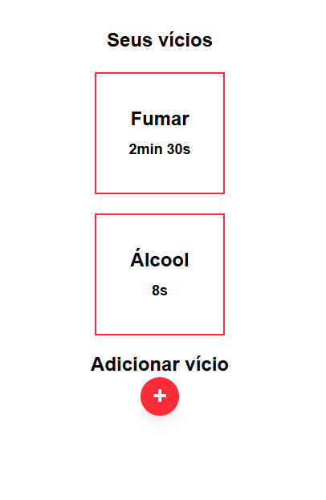

Aplicação fullstack para acompanhar quanto tempo você está sem um vício.

O usuário escolhe um vício (como fumar, álcool ou açúcar) e o sistema inicia automaticamente um contador mostrando há quanto tempo ele está sem consumir.

---

## 📸 Preview

---

## 🚀 Tecnologias utilizadas

### Frontend
- Next.js
- React
- TypeScript
- TailwindCSS

### Backend
- Spring Boot
- Spring Data JPA
- Hibernate

### Banco de dados
- H2 Database (em memória)

---

## 📦 Estrutura do projeto
quit-tracker
├ frontend → aplicação Next.js
└ backend → API Spring Boot

---

## ✨ Funcionalidades

- Adicionar vício
- Bloquear vícios duplicados
- Contador em tempo real
- Integração frontend + backend
